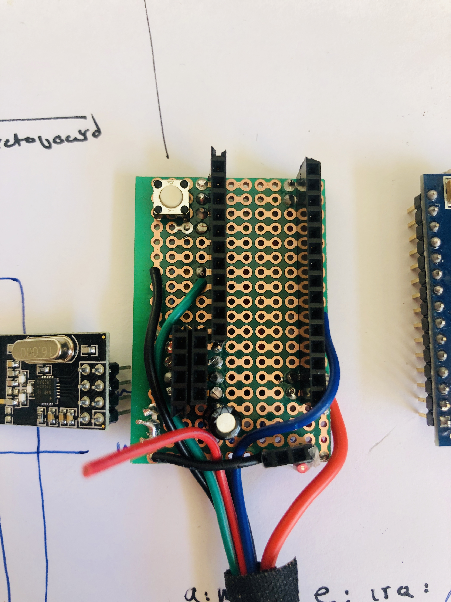

# LED-swarm (scarfswarm fork)
Arduino based radio synced addressable LEDstrips

- project log: https://hackmd.io/@100ideas/scarfswarm
- this codebase is based on a fork of [Chuck Sommerville's **led-swarm** project](https://github.com/chucks13/LED-swarm/blob/master/theory.txt) - ~20 independant 150-LED staffs that synchronize animations over 2.4ghz, built with:
    - [TeensyLC microcontroller](https://www.pjrc.com/store/teensylc.html)
    - [nRF24L01+ 2.4 Ghz radio](http://a.co/d/3rhLgCT)
    - [WS2811](https://hackmd.io/@100ideas/scarfswarm#LED-strips) LED strips
    - [FastLED.h library](https://github.com/FastLED/FastLED)
    - [NRFLite.h library](https://github.com/dparson55/NRFLite)
- chuck's repo: https://github.com/chucks13/LED-swarm/blob/master/theory.txt
- [Chuck Sommerville thread on LEDs ARE AWESOME](https://www.facebook.com/groups/LEDSAREAWESOME/1046179785577480/?comment_id=1046277275567731&reply_comment_id=1066784526850339)

This fork contains some modifications to Chuck's codebase I made to better understand how his nRF synchronization scheme worked. I've implemented a strobe function that makes the owners scarfe strobe white for a fraction of a second, and also broadcast a special 'strobe' command packet, causing nearby units to do the same.

The format of the packet is very much a proof-of-concept hack to check latency. Currently, if the radio sees a packet with the contents `0x6f740064` ('otd' in ascii), it triggers the strobe logic. When a user presses the strobe button, that device sends a packet with the contents `0x426c697a` ('Bliz' in ascii) stored in `TAGID_ALT`. Somehow I'm not reading the incoming packet properly. It should be reading `0x6f740064` but that's not what my code sees. I'm assuming I can read from the first byte, but maybe I need to add an offset, not sure. In any case, the logic for now works.

One of my units uses an old arduino nano, the other one a newer one. Change `board = nanoatmega328new` to `board = nanoatmega328` in `platformio.ini` if you have an old board and are using platformio to compile/upload. Change the definitions for `NANODOTPROTOBOARD` depending on your own pinouts.

If you want to make a protoboard, here's how I did it:





- that's a 100uF cap between the positive/negative power lines for the nRF. 22uF tantalum supposedly works even better.
- I added a heavy-duty power line to source power from an external usb battery pack if I decide to run a much longer string. in my tests power provided directly from the nano's usb input was sufficient to run a 60-led strip.

---

## c++ reference

c++ fundamental types
https://en.cppreference.com/w/cpp/language/types

What are uint8_t, uint16_t, uint32_t and uint64_t?
- They are equal respectively to: unsigned char, unsigned short, unsigned int and unsigned long long.
- In C99 the available basic integer types (the ones without _t) were deemed insufficient, because their actual sizes may vary across different systems. So, the C99 standard includes definitions of several new integer types to enhance the portability of programs. The new types are especially useful in embedded environments. All of the new types are suffixed with a _t and are guaranteed to be defined uniformly across all systems.

```c
/* C Program to demonstrate use of bitwise operators */
#include<stdio.h> 
int main() 
{ 
    unsigned char a = 5, b = 9; // a = 5(00000101), b = 9(00001001) 
    printf("a = %d, b = %d\n", a, b); 
    printf("a&b = %d\n", a&b); // The result is 00000001 
    printf("a|b = %d\n", a|b);  // The result is 00001101 
    printf("a^b = %d\n", a^b); // The result is 00001100 
    printf("~a = %d\n", a = ~a);   // The result is 11111010 
    printf("b<<1 = %d\n", b<<1);  // The result is 00010010  
    printf("b>>1 = %d\n", b>>1);  // The result is 00000100  
    return 0; 
}
```

set bitrate on nRF
`if (!_radio.initTwoPin(_settings.RadioId, PIN_RADIO_MOMI, PIN_RADIO_SCK, NRFLite::BITRATE250KBPS))`

